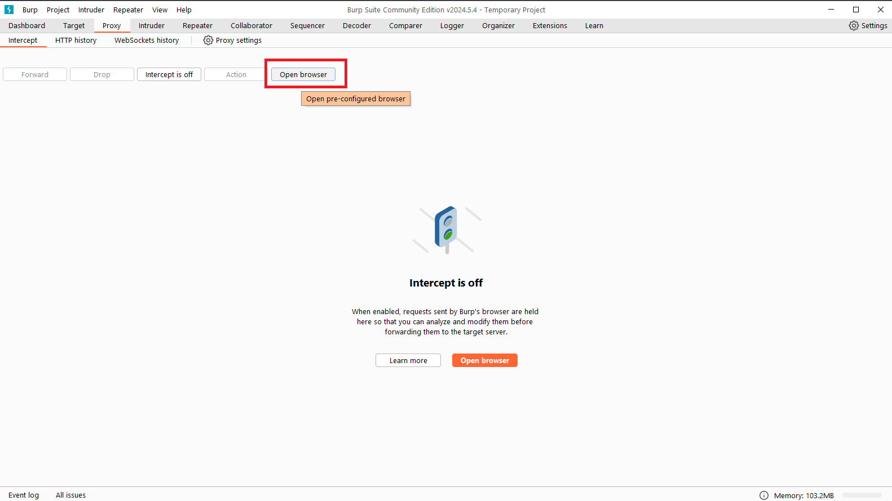

# Semaine CyberSécurité

Bienvenue dans ce module dédié à la sécurité informatique. L'objectif de ce parcours est de vous familiariser avec les protections les plus connues, que ce soit du côté applicatif ou du côté serveur.

Cette semaine un peu spéciale comporte des objectifs que l'on peut atteindre en théorie sans peine : il suffit de savoir utiliser les mécanismes natifs de protection des frameworks. 
Mais à quoi bon savoir les utiliser si on ne comprend pas à quoi ils servent, et comment ils fonctionnent ? 
La sécurité web est un domaine qui progresse parallèlement à la programmation, dans un espace discret. Si on ne regarde pas, il est presque difficile d'imaginer l'ampleur des événements qui ont lieu sous nos yeux. C'est une course constante et perdue d'avance sur laquelle nous avons une vision retardée, celle des défenseurs : Blue Team.
Cette semaine sera l'occasion de passer aussi de l'autre côté. Du côté obscur. En devenant une Red Team.

Nous verrons un petit bout d'histoire ( très subjectif ) de la sécurité à travers des profils et des événements qui m'ont personnellement marqué.
Nous allons découvrir comment exploiter des failles de sécurité, puis comment s'en défendre. 
Ce sera l'opportunité d'apprendre à travers des défis. Certains que nous réussiront, d'autres que nous ne franchirons pas. Mais toujours dans l'objectif de comprendre ce que l'on fait et pourquoi on le fait.

## Pourquoi la Sécurité est-elle Cruciale ?
La sécurité informatique est devenue un enjeu majeur pour les entreprises et les particuliers. Les attaques peuvent avoir des conséquences dévastatrices, allant de la perte de données à l'atteinte à la réputation d'une organisation. Ce module vise à vous donner les outils nécessaires pour identifier, prévenir et réagir face aux menaces standard.

## Pré-requis
Ce module est destiné à tous ceux qui souhaitent approfondir leurs connaissances en sécurité informatique. Aucune compétence préalable en sécurité n'est requise, mais une compréhension de base des concepts informatiques sera utile.

## Objectifs du Module
* Comprendre les Menaces : Identifiez les menaces courantes et leurs impacts potentiels.
* Maîtriser les Outils de Sécurité : Utilisez des outils professionnels pour analyser et sécuriser vos applications.
* Pratiquer en Conditions Réelles : Appliquez vos compétences dans des environnements simulés et réels.
* Identifier et de corriger les vulnérabilités dans divers environnements.

## Contenu du Module

- [Jour 1](https://google.com)
- [Jour 2](https://google.com)
- [Jour 3](https://google.com)
- [Jour 4](https://google.com)
- [Jour 5](https://google.com)

# Ressources et définitions en vrac

## Hacking éthique ?
Le hacking éthique, aussi connu sous le nom de penetration testing (pentest), est une pratique légale et éthique qui consiste à tester la sécurité d'un système informatique ou d'un réseau en identifiant et en exploitant les vulnérabilités potentielles. Les professionnels du hacking éthique utilisent les mêmes techniques que les hackers malveillants, mais dans un cadre autorisé et dans le but d'améliorer la sécurité des systèmes en trouvant et en corrigeant les failles de sécurité avant qu'elles ne soient exploitées par des cybercriminels.

## Pratiques de Sécurité en Entreprise : Approches et Équipes Essentielles
Les entreprises mettent en place plusieurs pratiques et équipes pour renforcer leur sécurité et tester leurs défenses. Voici quelques concepts courants :

1. <u>**Blue Team, Red Team, Purple Team**</u> :

    * <u>**Blue Team**</u> : C'est l'équipe chargée de la défense. Elle surveille activement les systèmes, détecte les incidents de sécurité, répond aux incidents et met en œuvre des mesures préventives et correctives.

    * <u>**Red Team**</u> : C'est l'équipe d'attaque. Elle simule des attaques réalistes contre les systèmes de l'entreprise pour évaluer l'efficacité des défenses en place. Son objectif est de trouver des failles de sécurité comme le ferait un véritable hacker.

    * <u>**Le Purple Team**</u> est une approche collaborative entre les équipes Blue Team et Red Team. Contrairement au Red Team qui agit de manière indépendante, le Purple Team facilite la communication et la collaboration entre les deux équipes. Cela permet d'améliorer la détection des attaques et la réponse aux incidents en temps réel.

2. Tabletop Exercises (Exercices de simulation) :

    * Ces exercices simulent des incidents de sécurité dans un environnement contrôlé. Les équipes de sécurité et les parties prenantes clés se réunissent pour discuter et élaborer des plans de réponse à des scénarios de cyberattaque spécifiques. Cela permet de tester les procédures d'urgence et de sensibiliser les équipes à la gestion des crises.

3. Threat Intelligence :

    * L'intelligence sur les menaces consiste à surveiller et à analyser les menaces potentielles pesant sur l'entreprise. Elle fournit des informations sur les techniques d'attaque actuelles, les acteurs de la menace et les vulnérabilités exploitées, ce qui permet à l'entreprise d'adapter sa défense en conséquence.

4. Bug Bounty Programs (Programmes de primes à la découverte de failles) :

    * Ces programmes invitent les chercheurs en sécurité indépendants (hackers éthiques) à identifier et à signaler les vulnérabilités dans les systèmes de l'entreprise en échange d'une récompense monétaire ou d'autres avantages. Cela permet d'identifier les failles avant qu'elles ne soient exploitées par des acteurs malveillants.

En combinant ces approches, les entreprises renforcent leur posture de sécurité en identifiant et en corrigeant proactivement les vulnérabilités, en formant leur personnel à réagir efficacement aux incidents de sécurité et en restant à jour sur les dernières menaces et techniques d'attaque.

## CVE
Les [CVE](https://www.cvedetails.com/), abréviation de "Common Vulnerabilities and Exposures" (Vulnérabilités et Expositions Courantes), sont une liste publique et normalisée d'identifiants uniques pour les failles de sécurité informatique. Chaque CVE est assigné à une vulnérabilité spécifique dans un logiciel ou un matériel informatique.

Voici quelques points clés sur les CVE :

* <u>Identification Unique</u> : Chaque CVE est un identifiant unique qui permet aux chercheurs en sécurité, aux administrateurs système et aux utilisateurs de se référer de manière unifiée à une vulnérabilité spécifique.

* <u>Standardisation</u> : Les CVE sont normalisés par l'organisation MITRE Corporation, en collaboration avec la communauté de la sécurité informatique. Cela assure une méthode cohérente pour documenter et identifier les vulnérabilités.

* <u>Référencement</u> : Les CVE sont utilisés dans les bases de données de sécurité, les outils d'analyse des vulnérabilités et les rapports de sécurité pour faciliter la recherche, la communication et la gestion des vulnérabilités.

* <u>Exemple de Format</u> : Un exemple de CVE est "CVE-YYYY-NNNN", où YYYY représente l'année d'attribution du CVE et NNNN est un numéro séquentiel attribué à chaque vulnérabilité identifiée cette année-là.

* <u>Importance</u> : Les CVE aident les organisations à comprendre et à prioriser les correctifs de sécurité, à évaluer les risques potentiels et à communiquer efficacement sur les vulnérabilités.

En résumé, les CVE sont essentiels pour la gestion et la communication des vulnérabilités de sécurité, jouant un rôle crucial dans la sécurisation des systèmes informatiques contre les attaques potentielles.

## CVSS (Common Vulnerability Scoring System)
Le CVSS est un système standardisé et largement utilisé pour évaluer et mesurer la gravité des vulnérabilités. Il fournit une notation numérique basée sur plusieurs critères qui permettent aux organisations de prioriser les correctifs et de comprendre l'impact d'une vulnérabilité. Voici les principaux composants du CVSS :

* <u>Base Score</u> : Un score de base qui évalue l'impact d'une vulnérabilité en fonction de facteurs comme la complexité de l'exploitation, l'impact sur la confidentialité, l'intégrité et la disponibilité des données.

* <u>Temporal Score</u> : Un score temporel qui prend en compte les facteurs qui peuvent changer avec le temps, tels que la disponibilité de correctifs et l'exploitation active de la vulnérabilité.

* <u>Environmental Score</u> : Un score environnemental facultatif qui permet aux organisations de personnaliser l'évaluation en fonction de leur propre environnement informatique.

Les scores CVSS sont présentés sous forme de nombre décimal (par exemple, 9.8) où des valeurs plus élevées indiquent une plus grande sévérité de la vulnérabilité.

### CVSSv3
Le CVSSv3 est la version la plus récente et améliorée du CVSS, introduite pour fournir une évaluation plus précise des vulnérabilités modernes et complexes. Il a raffiné les métriques utilisées dans le CVSS original et fournit des indications plus claires sur la gravité des vulnérabilités, ce qui aide les équipes de sécurité à prendre des décisions éclairées sur la gestion des risques et des correctifs.

## Root Me
Root Me est une plateforme éducative dédiée à la sécurité informatique et au hacking éthique. Elle propose une variété de défis et de parcours pour développer vos compétences en cybersécurité. Tester vos connaissances à travers des scénarios réalistes, couvrant des domaines tels que la cryptographie, l’exploitation de failles et la sécurité réseau. Attention toutefois, les exercices deviennent très rapidement compliqué et demande de se renseigner en amont avec parfois peu d'indices.

**<u>Note</u> :** Vous retrouverez sur Root Me comme sur de nombreux sites permettant de pratiquer la cybersécurité, principalement deux types d'exercices : 

* Des [**Challenges**](https://www.root-me.org/fr/Challenges/), qui seront en fait des exercices guidés, organisés par difficulté et thème, associé à des ressources.
    - Je vous conseil de voir les exercices de niveau 1/4 dans les domaines suivant : [Web - Client](https://www.root-me.org/fr/Challenges/Web-Client/) et [Web - Serveur](https://www.root-me.org/fr/Challenges/Web-Serveur/), car ils vous concernent directement.

* Des [**Capture the Flag**](https://www.root-me.org/fr/Capture-The-Flag/) 
    - CTF (Capture The Flag) est un type de compétition de sécurité informatique où les participants tentent de résoudre des énigmes, des défis et des problèmes liés à la sécurité informatique pour obtenir des "flags" ou des marqueurs spécifiques. Ces flags peuvent être des chaînes de texte, des fichiers spécifiques, des codes secrets, etc. Les CTFs sont souvent organisés pour permettre aux participants de tester et d'améliorer leurs compétences en matière de hacking et de sécurité informatique dans un environnement contrôlé et légal.

## Burp suite

Burp Suite est un outil de test de sécurité des applications web largement utilisé par les professionnels de la sécurité informatique et les chercheurs en sécurité. Conçu par PortSwigger, Burp Suite offre une suite complète d'outils pour découvrir, tester et sécuriser les vulnérabilités des applications web. Que ce soit pour l'analyse des requêtes HTTP, la manipulation de données, la découverte de vulnérabilités comme les injections SQL ou les Cross-Site Scripting (XSS), ou encore pour l'automatisation des tests de sécurité, Burp Suite est une référence incontournable dans le domaine de la sécurité des applications web.

L'outil est reconnu pour sa flexibilité et ses fonctionnalités avancées qui permettent aux professionnels de la sécurité de simuler des attaques contre des applications web afin d'identifier et de corriger les failles de sécurité avant qu'elles ne soient exploitées par des attaquants. Que vous soyez débutant ou expert en sécurité informatique, Burp Suite offre une plateforme robuste pour améliorer la sécurité de vos applications web.

### Vidéos tutoriel Burp Suite

Je vous met tout d'abord une vidéo découverte de Burp Suite d'un de nos amis québecois.
[Comment utiliser Burp Suite? - "Web Application PenTesting"](https://www.youtube.com/watch?v=SHiNiVNuZOA)

Attention toutefois, vous n'avez pas besoin de configurer votre navigateur habituel pour qu'il utilise Burp comme proxy (comme il le fait à partir de **3.56** jusqu'à **6.30**).
En effet Burp Suite vous propose un Chromium déjà configuré pour vos tests, il vous suffit de cliquer sur "Open browser" dans la partie proxy comme indiqué sur le screenshot ci-dessous :

Voici une deuxième vidéo tutoriel qui va un peu plus en détail dans l'utilisation de Burp Suite : 
[🌏 Sécurité Web : Maitriser Burp Suite [Débutant - Intermédiaire] [2024]](https://youtu.be/rQRhHhhGTjM?si=EGtnDLA7edALxnat)

## Portswigger

PortSwigger est la société britannique à l'origine de Burp Suite. Fondée par Dafydd Stuttard, un expert renommé en sécurité informatique, PortSwigger se spécialise dans le développement de solutions innovantes pour la sécurisation des applications web. Burp Suite, leur produit phare, est largement reconnu pour ses capacités avancées en matière de découverte et d'exploitation de vulnérabilités, permettant aux professionnels de la sécurité de détecter et de corriger efficacement les failles de sécurité.

En plus de Burp Suite, PortSwigger propose une plateforme d'apprentissage en ligne appelée "PortSwigger Academy". Cette plateforme offre une gamme d'exercices pratiques et de laboratoires interactifs conçus pour améliorer les compétences en sécurité informatique, spécifiquement axés sur l'utilisation de Burp Suite. Que vous soyez débutant cherchant à apprendre les bases du test d'intrusion ou expert cherchant à affiner vos compétences, PortSwigger Academy offre des ressources essentielles pour comprendre et maîtriser Burp Suite dans un environnement d'apprentissage pratique et sécurisé.

Je vous propose donc de participer à quelques exercices proposés par la plateforme, qui sont plus accessible que ceux de Root Me et vous permettront de prendre en main Burp Suite : [PortSwigger Academy](https://portswigger.net/web-security/all-topics)

Ils sont composés essentiellement de topics qui prennent la forme de cours, et de labs qui sont des exercices de pratique.

## OWASP 

L'OWASP (Open Web Application Security Project) est une organisation à but non lucratif dédiée à l'amélioration de la sécurité des logiciels. Depuis sa création, l'OWASP s'efforce de fournir des ressources gratuites et ouvertes qui aident les développeurs et les professionnels de la sécurité à protéger les applications web contre les menaces en constante évolution. Le projet est reconnu pour ses publications emblématiques, telles que l'[OWASP Top Ten](https://owasp.org/www-project-top-ten/), qui énumère les principales vulnérabilités de sécurité des applications web.

## ZAP (Zed Attack Proxy)

ZAP se distingue comme un puissant outil de test de sécurité des applications web. Conçu pour être accessible et flexible, ZAP permet aux utilisateurs de détecter et d'exploiter les failles de sécurité courantes. Il propose des fonctionnalités telles que l'analyse automatisée, la manipulation des requêtes HTTP, et des options de test manuel approfondi. En tant qu'outil open source, ZAP bénéficie d'une large communauté de contributeurs qui s'engagent à le maintenir à jour et à l'améliorer en permanence. C'est un outil essentiel pour quiconque souhaite approfondir la sécurité des applications web.

### Vidéo découverte ZAP

[ZAP : SCAN pour trouver des FAILLES de SÉCURITÉ sur votre app Web - Public/Admin - Piratage éthique](https://www.youtube.com/watch?v=7cMTWFDtJbk)

## Wireshark

Wireshark est un logiciel open source de surveillance et d'analyse du trafic réseau. Il permet aux utilisateurs d'intercepter et d'inspecter le trafic de données passant à travers un réseau. En capturant les paquets de données qui circulent entre les différents périphériques d'un réseau, Wireshark offre une vue détaillée et en temps réel des communications réseau.

### Fonctionnalités Principales :

1. **Capture de Paquets** : Wireshark peut capturer des paquets de données à partir de réseaux câblés et sans fil. Il supporte une large gamme d'interfaces réseau et peut capturer le trafic sur Ethernet, Wi-Fi, et d'autres types de connexions réseau.

2. **Analyse en Profondeur** : Une fois les paquets capturés, Wireshark permet aux utilisateurs d'analyser leur contenu en détail. Il affiche des informations telles que les adresses IP source et destination, les ports utilisés, les protocoles réseau (comme TCP, UDP, HTTP, etc.), et même le contenu des données transmises.

3. **Détection d'Anomalies** : En inspectant le trafic réseau, Wireshark peut détecter des anomalies telles que des paquets malformés, des tentatives d'attaque ou des comportements suspects. Cela en fait un outil précieux pour le diagnostic de problèmes réseau et la détection d'intrusions.

4. **Filtrage et Recherche** : Wireshark offre des fonctionnalités avancées de filtrage et de recherche, permettant aux utilisateurs de se concentrer sur des paquets spécifiques en fonction de critères comme les adresses IP, les protocoles, les types de paquets, etc.

5. **Analyse de Performance** : En plus de l'analyse de sécurité, Wireshark peut également être utilisé pour évaluer la performance du réseau en examinant les délais de transmission, la perte de paquets, et d'autres métriques importantes.

### Utilisation dans la Sécurité Informatique :

En matière de sécurité informatique, Wireshark est souvent utilisé pour :

* Identifier et analyser les attaques réseau telles que les dénis de service (DoS), les tentatives d'intrusion, les fuites d'informations sensibles, etc.

* Auditer le trafic réseau pour assurer la conformité aux politiques de sécurité et aux régulations.

* Développer et tester des stratégies de défense en simulant des scénarios d'attaque et en évaluant les réponses du système.

### Vidéo tutoriel Wireshark

[Wireshark Tutorial for Beginners | Network Scanning Made Easy](https://youtu.be/qTaOZrDnMzQ?si=msirNDYHnf_ei5Ck)
